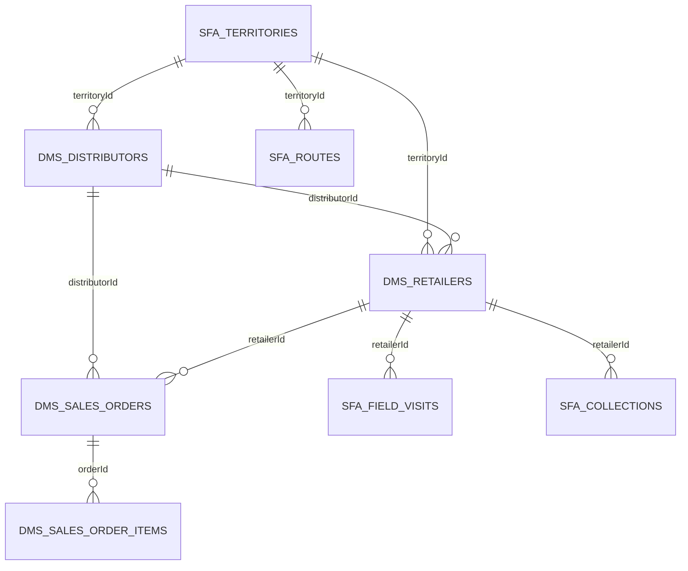

# DMS current state

Audit date: 2026-09-21. Scope reviewed: `cbmnp-backend`, `cbmnp-frontend`, and the existing `sfa-dms` slice. Repository root: `D:\CBMNP\cbmnp-backend` (the DMS backend belongs to this child Git repository; `D:\CBMNP` itself is not a repository).

## Detected stack and conventions

- Backend: NestJS 10, TypeORM 0.3, PostgreSQL-oriented entities (`uuid`, `numeric`, `jsonb`), Jest/ts-jest. The module is registered in `cbmnp-backend/src/app.module.ts`.
- Frontend: Next.js 14 App Router, React 18, TypeScript, Ant Design, Tailwind, Redux Toolkit Query.
- Existing backend module: controller → service → TypeORM entity, under `src/modules/v1/<module>`.
- Existing frontend convention: dashboard page plus `_component` UI and an RTK Query API file.
- Database delivery is inconsistent: the DMS schema is an additive SQL script at `database/migrations/20260920_create_sfa_dms_module.sql`; no TypeORM migration runner/configuration was found. `src/database/database.module.ts` enables schema synchronize outside production.

## DMS file map

| Area | Files | Observed behavior |
|---|---|---|
| Backend API | `src/modules/v1/sfa-dms/sfa-dms.controller.ts`, `sfa-dms.service.ts`, `sfa-dms.module.ts` | Generic list/create/update endpoints under `/v1/sfa-dms`; organization sourced from `x-organization-id`. |
| Persistence | `src/modules/v1/sfa-dms/entities/sfa-dms.entity.ts` | Nine small additive entities. |
| Schema script | `database/migrations/20260920_create_sfa_dms_module.sql` | Creates those tables and three date indexes. |
| Frontend page | `src/app/[locale]/(dashboard)/sfa-dms/page.tsx` | Dashboard shell and rollout messaging. |
| Frontend workspace | `src/app/[locale]/(dashboard)/sfa-dms/_component/SfaDmsWorkspace.tsx` | CRUD drawers/tables for the supported resources. |
| Frontend data | `src/redux/api/sfaDmsApi.ts`, `src/redux/api/dashboardApi.ts` | RTK Query calls to SFA/DMS endpoints. |

## Existing tables and ERD

| Table | Purpose |
|---|---|
| `sfa_territories` | territory code/name, division/district |
| `dms_distributors` | distributor contact, warehouse ID, credit limit |
| `dms_retailers` | outlet/distributor/territory references and optional coordinates |
| `sfa_routes` | territory and rep assignment |
| `sfa_field_visits` | planned/completed visit data and check-in coordinates |
| `dms_sales_orders`, `dms_sales_order_items` | secondary-order header/items (items not exposed by UI/API workflow) |
| `sfa_collections` | retailer field collections |
| `sfa_sales_targets` | rep targets by period |

The diagram shows logical ID references; entities do not declare foreign keys for these relationships.

## What works vs. is stubbed

Works at a foundation level: organization-scoped CRUD for territories, distributors, retailers, routes, visits, order headers, collections, and sales targets; dashboard counts; BDT-capable `numeric` money columns; collection UI options include bKash and Nagad; basic route/visit coordinates are stored.

Stubbed or unsafe: all resources use unrestricted generic payloads (no DTO validation or per-resource authorization); order headers are not transactionally linked to order items, inventory, pricing, credit, delivery, AR/GL, VAT, approval, or audit; all status values are client-controlled; no SFA offline/mobile/photo/attendance workflow; no DMS-specific tests. The UI readiness values are explicitly 0%.

## Current integrations

The application contains Finance, Accounting, Inventory, Inventory Operations, Sales Operations, Procurement, Governance, Activity Log, Warehouse, Product, Customer, and Notification modules. Reusable foundations found include `product_batches` with expiry and warehouse quantities, `customer_credit_profiles`, `approval_rules`, `audit_logs`, `journal_entries`, stock transfers/adjustments, and finance ledgers. `SfaDmsModule` imports none of those modules and makes no service/event calls, so there is currently no functional DMS integration.

## Test baseline

Command: `npm test -- --runInBand` in `cbmnp-backend`.

Initial result: failed — 23 suites failed, 1 passed; 18 tests failed, 1 passed. No SFA/DMS tests exist. Primary existing-suite blockers are unresolved `src/helpers/paginationHelpers` aliases, test modules missing TypeORM repository/DataSource providers, and a v2 order test importing `OrderService` instead of `OrderServiceV2`.

Phase 0.5 baseline (after Jest `moduleNameMapper` resolves `src/*`): pending rerun. The new `npm run test:dms` target isolates new DMS tests from legacy failures.

## Risks / technical debt

1. The generic controller exposes `orderItems` directly and permits arbitrary field mutation without validation, ownership checks, or workflow guards.
2. Monetary entity properties are TypeScript `number`, even though database columns are decimal/numeric; TypeORM/Postgres decimal serialization needs an explicit decimal strategy before calculations.
3. DMS table references have mixed `uuid`/`varchar` types and no FK constraints.
4. The standalone SQL is not an executable migration under an identified runner; fresh/existing deployment behavior is unverified.
5. The module does not consume the existing permissions, approvals, governance audit logging, finance, inventory, or sales services.
